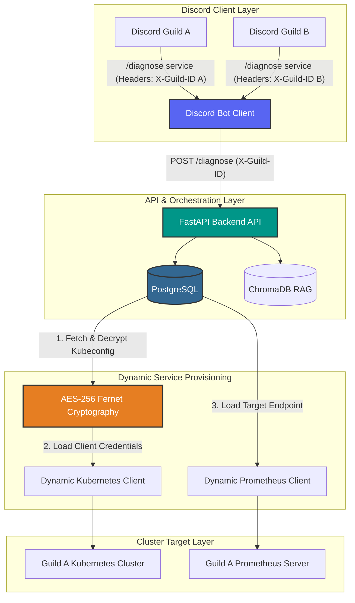
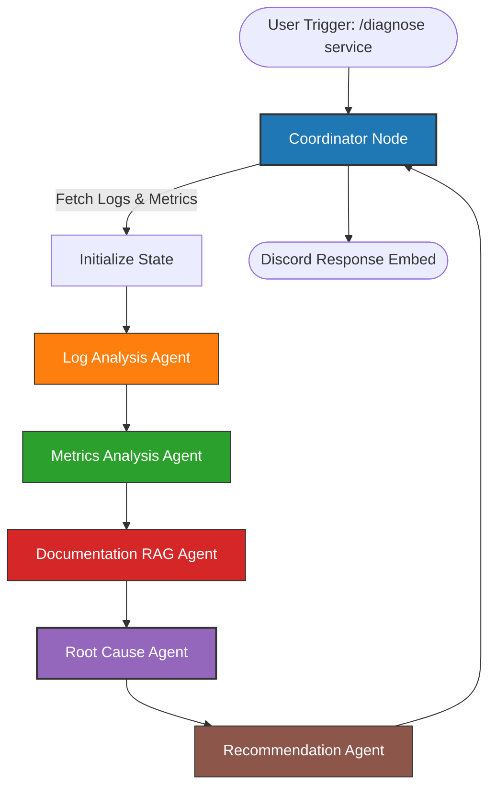

# 🤖 AI DevOps SRE Copilot (Multi-Tenant SaaS)

An intelligent, enterprise-ready, AI-powered Site Reliability Engineering (SRE) assistant designed for **Discord**. It allows multiple organizations/servers (guilds) to securely register, monitor, and troubleshoot their independent Kubernetes clusters and Prometheus metric endpoints. 

Built using **FastAPI**, **Google Gemini 2.5 Flash**, **LangGraph**, **ChromaDB**, and **discord.py**.

---

## 🏛️ System & Multi-Tenant SaaS Architecture

The SRE Copilot is built with security, high isolation, and multi-tenancy at its core. 

### Core Components
1. **Discord Client Bot (`discord-bot/`)**: A stateless discord.py client registering modern application slash commands. It automatically forwards the current server's Discord Guild ID via the HTTP header `X-Guild-ID` on all API requests.
2. **FastAPI REST API Backend (`backend-api/`)**: Evaluates incoming headers and coordinates multi-agent LangGraph workflows.
3. **Database (PostgreSQL)**: Stores encrypted Kubernetes configurations and Prometheus endpoints per Guild ID.
4. **Vector Store (ChromaDB)**: Houses indexed SRE runbooks, runbook snippets, and reference manuals to feed RAG agents.



### Multi-Agent SRE Workflow (LangGraph)
When a diagnostic operation is invoked, the coordinator spins up a stateful graph directing specialized AI agents:



---

## 🛠️ Technology Stack
* **Language Runtime**: Python 3.12, Uvicorn, FastAPI
* **AI & Orchestration**: Google Gemini 2.5 Flash, LangGraph, LangChain
* **Vector DB**: ChromaDB with offline `SentenceTransformers` embeddings (`all-MiniLM-L6-v2`)
* **Relational Database**: PostgreSQL (Neon Serverless in cloud prod, Dockerized in local dev)
* **SaaS Cryptography**: Symmetric AES-256 encryption via PyCa/cryptography
* **Containerization**: Docker, Docker Compose
* **Infrastructure**: Terraform, AWS EC2

---

## ⚙️ Security & Cryptography Model

To safeguard Kubernetes credentials and cluster security context:
* **AES-256 Symmetric Encryption**: Uploaded kubeconfig payloads are encrypted using Fernet (symmetric authenticated cryptography) before database persistence.
* **Key Derivation**: 
  - SRE Copilot reads `ENCRYPTION_KEY` from the environment.
  - If `ENCRYPTION_KEY` is not explicitly set, the system dynamically derives a stable 32-byte URL-safe base64 key by hashing `GEMINI_API_KEY`.
  - A fallback key is provided as a secondary safety check.
* **Git Safety**: Raw credentials (`kube/config`) and environments are tracked in `.gitignore`. EKS credentials are removed from git cache to prevent accidental check-ins.

---

## 🚀 Getting Started

### 1. Prerequisites
* Python 3.12 (if executing scripts/tests locally)
* Docker & Docker Compose
* Google Gemini API Key
* Discord Bot Token (with Applications.Commands gateway intent enabled)

### 2. Configuration Setup
Copy `.env.example` to `.env` and fill in active keys:
```bash
cp .env.example .env
```
Ensure `DISCORD_TOKEN` and `GEMINI_API_KEY` are provided.

### 3. Run with Docker Compose
To start the backend, Discord bot, vector database, and local monitoring components simultaneously:
```bash
docker-compose up --build -d
```
Verify startup endpoints:
* **FastAPI Backend Docs**: `http://localhost:8000/docs`
* **Health Check**: `http://localhost:8000/health`
* **Prometheus**: `http://localhost:9090`
* **Grafana Dashboard**: `http://localhost:3000` (User: `admin`, Pass: `admin`)

---

## 🎮 Discord Slash Commands Guide

The Discord Bot supports the following commands:

### Tenant Administration
* **/setup `[kubeconfig_file]` `[prometheus_url]`** (Admin Only)  
  Uploads and encrypts a Kubernetes `kubeconfig` configuration file for the server, along with an optional custom Prometheus metrics server url.
  * *Parameters*:
    - `kubeconfig_file`: Discord Attachment (Max 5MB).
    - `prometheus_url` (Optional): Custom Prometheus base endpoint.
* **/status**  
  Checks system liveness and config status (Backend connectivity, ChromaDB, Gemini status).

### Diagnostics & Monitoring
* **/deployments**  
  Queries and lists all active deployments in the configured cluster namespace.
* **/logs `[service]` `[query]` `[timeframe]`**  
  Retrieves logs for the first active pod in a service, filtering by timeframe (e.g. `30m`, `2h`, `1d`) and search terms.
* **/diagnose `[service]`**  
  Triggers the LangGraph multi-agent diagnostic pipeline. Runs real-time log parses, metric checks, runbook RAG lookups, and outputs a rich color-coded embed detailing:
  - Pod state and restarts.
  - Log warning/exception analysis.
  - Latency and Error Rate spikes.
  - Root cause summary and action-oriented CLI remediation steps.
* **/explain-error `[error_text]`**  
  Breaks down custom stack traces and system logs using AI, providing potential causes and code-level fixes.
* **/ask `[question]`**  
  Answers general SRE questions referencing runbooks loaded into the vector database.
* **/search-docs `[query]`**  
  Performs similarity search against internal RAG runbook files stored in ChromaDB.
* **/history `[service]` `[limit]`**  
  Fetches past incident diagnostic histories and saved root causes from PostgreSQL logs.

---

## 🧪 Local Testing & Mock Mode

For rapid offline testing and debugging without configuring an active Kubernetes cluster:

### Mock Configuration
Set `MOCK_MODE=true` in your `.env` file:
```env
MOCK_MODE=true
```
Under Mock Mode:
1. **Kubernetes API Calls**: Instead of connecting to a live cluster, `K8sService` returns predefined pod states representing classic scenarios:
   - `payment-service`: Simulates a database connection timeout crashloop (`CrashLoopBackOff`, exit code restarts).
   - `analytics-service`: Simulates a Java heap memory leak (`OOMKilled`).
   - `frontend-service`: Simulates downstream latency/timeout anomalies.
2. **Prometheus Metrics**: Returns simulated query results mapping to CPU limit spikes, high latency, or error percentage spikes.
3. **AI Pipeline**: If `GEMINI_API_KEY` is not provided, the API utilizes a rule-based fallback logic to produce accurate SRE answers.

> [!WARNING]
> **Cloud Backend & Local Cluster Limit**: If you run the FastAPI backend on an AWS EC2 instance, it cannot connect to local Kubernetes clusters (e.g. Docker Desktop, Minikube) due to NAT and localhost network boundaries. To test live cluster integration (`MOCK_MODE=false`), you must supply public/cloud Kubernetes API endpoints (like AWS EKS) or run the FastAPI backend locally on the same network.

---

## 🛡️ Production Deployment Guide

### Automated AWS EC2 Provisioning
The project includes a PowerShell script to automatically deploy the entire system to AWS using Terraform and Docker Compose:
```powershell
.\deploy.ps1
```
This script provisions an AWS VPC, Security Group, EC2 Instance (t3.small), installs Docker, uploads the project files, and starts the container stack.

### Destroy Infrastructure
To clean up and destroy all provisioned AWS cloud resources:
```powershell
.\cleanup.ps1
```

For a detailed walkthrough, manual step-by-step setup, or GitHub Actions CI/CD pipeline configuration, refer to the [Production Deployment Guide](file:///c:/Users/R.K%20Singh/Desktop/copilot-devops/deployment.md).

---

## 🔬 Running Tests

Run automated tests using pytest:

### Local Python Environment
```bash
cd backend-api
pip install -r requirements.txt
pytest
```

### Running inside Docker
```bash
docker exec -it copilot-backend pytest
```
